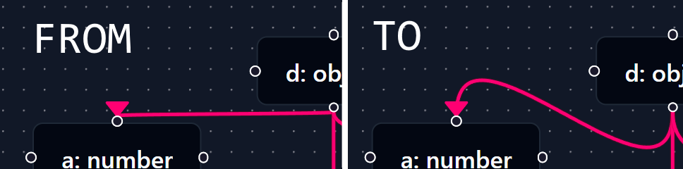

# REACTFLOW-BETTER-BEZIER-EDGE

[](https://www.npmjs.com/package/reactflow-better-bezier-edge) [](https://www.npmjs.com/package/reactflow-better-bezier-edge) [](LICENSE)&nbsp;&nbsp;&nbsp;[](https://github.com/soranoo/Donation)

Are you suffering the default bezier curve goes into your marker?

If so, this is the solution for you.



All credits go to [reactflow](https://reactflow.dev/) for the bezier curve calculation. I just made modifications to the original code to make it better.

Give me a ⭐ if you like it.

## 📦 Requirements

- ReactFlow >= 11.0.0

## 🚀 Getting Started

### Installation

```bash
npm install reactflow-better-bezier-edge
```

### Usage Example

```tsx
import { Position } from "reactflow";
import { getBetterBezierPath } from "reactflow-better-bezier-edge";

const [path, labelX, labelY, offsetX, offsetY] = getBetterBezierPath({
  sourceX: source.x,
  sourceY: source.y,
  sourcePosition: Position.Right,
  targetX: target.x,
  targetY: target.y,
  targetPosition: Position.Left,
  offset: 70,
});
```

## 📖 API Reference

### Parameters

The parameters for the bezier curve.
| Prop | Optional | Type | Default | Description |
| --- | --- | --- | --- | --- |
|sourceX|No|number| |The x-coordinate of the source node.|
|sourceY|No|number| |The y-coordinate of the source node.|
|sourcePosition|Yes|[Position](https://reactflow.dev/api-reference/types/position)|Position.Bottom|The position of the source node.|
|targetX|No|number| |The x-coordinate of the target node.|
|targetY|No|number| |The y-coordinate of the target node.|
|targetPosition|Yes|[Position](https://reactflow.dev/api-reference/types/position)|Position.Top|The position of the target node.|
|offset|Yes|number|0|The offset of the bezier curve.|

> [NOTE]\
> Play around with the `offset` to get the best result.

### Returns
| Array | Type | Description |
| --- | --- | --- |
|[0]|string|The path to use in an SVG <path> element.|
|[1]|number|The x position you can use to render a label for this edge.|
|[2]|number|The y position you can use to render a label for this edge.|
|[3]|number|The absolute difference between the source x position and the x position of the middle of this path.|
|[4]|number|The absolute difference between the source y position and the y position of the middle of this path.|


You can reference to [BezierEdge](https://reactflow.dev/api-reference/utils/get-bezier-path#signature) for more information.

## 🤝 Contributing

Contributions are welcome! If you find a bug , please open an issue. If you want to contribute code, please fork the repository and submit a pull request.

## 📝 License

This project is licensed under the MIT License - see the [LICENSE](LICENSE) file for details

## ☕ Donation

Love it? Consider a donation to support my work.

[](https://github.com/soranoo/Donation) <- click me~
